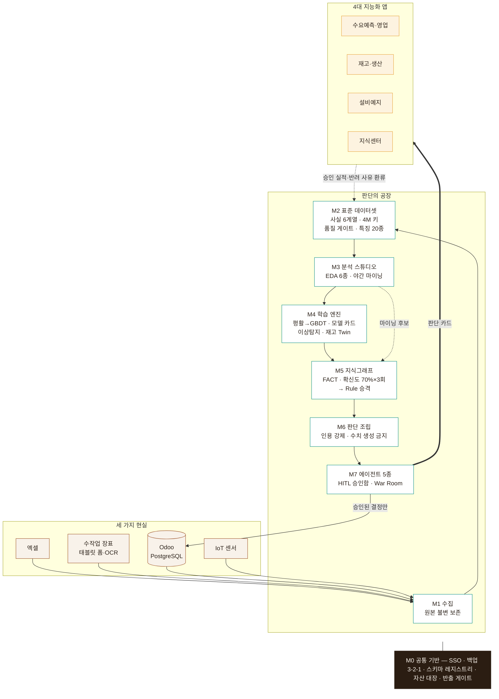

# AX Platform — 판단의 공장

『AI ERP 혁명 — Odoo와 지능형 ERP』의 AX 방법론을 소프트웨어로 굳힌 플랫폼.
「AX 플랫폼 구축 제안서·작업실행 계획서」의 모듈 M0~M7과
「실행 프롬프트집」의 작업 패키지 36개를 그대로 구현한다.

```
엑셀·수작업 장표·Odoo(PostgreSQL)
  → M1 수집(스테이징, 원본 불변 보존)
  → M2 표준 데이터셋(사실 테이블 6계열 · 4M/시점 키 · 특징량 저장소)
  → M3 분석 스튜디오(EDA 6종 · 야간 마이닝 · 보드)
  → M4 학습 엔진(평활→GBDT→(선택)딥러닝, 모델 카드, 시계열 분할 강제)
  → M5 온톨로지-지식그래프(FACT / CAUSAL_CANDIDATE(확신도) / Rule, 70%·3회 승격)
  → M6 LLM 판단(그래프 근거 조립, 인용 강제, 수치 생성 금지)
  → M7 에이전트·HITL 승인함·War Room(판단 카드)
```

## 아키텍처



## 설계 원칙 다섯

1. **오픈소스 우선** — 코어 전 계층 오픈소스. 상용은 어댑터로만.
2. **커스터디 내장** — 자산 대장·스키마 레지스트리·반출 게이트가 기반(M0).
3. **판단 카드 표준** — 모든 산출은 {제안, 수치, 구간, 근거 경로, 대안, 승인자, 상태} 한 형식.
4. **HITL 기본값** — 실제 값 변경은 승인 순간에만. LLM은 숫자를 만들지 않는다.
5. **얇은 수직 완주** — 첫 유스케이스(수요예측)가 M1→M7을 얇게 관통한다.

## 두 가지 실행 모드

| 모드 | 저장소 | 용도 |
|---|---|---|
| **demo** (기본) | SQLite + 파일 | 개발·검증·교육 — 외부 서비스 없이 전 파이프라인이 돈다 |
| **prod** | PostgreSQL·MinIO·Neo4j·MLflow·Ollama (deploy/docker-compose.yml) | 현장 배치 |

코어 로직은 두 모드가 동일하다 — `axp/db.py`의 저장 계층만 바뀐다.

## 빠른 시작 (demo 모드)

```bash
cd core && pip install -e .          # 또는: pip install -r requirements.txt
python -m demo.generate_data          # 합성 제빵 데이터 24개월 생성
python -m demo.run_e2e                # M1→M7 수직 완주 (판단 카드 승인·환류까지)
python -m demo.acceptance             # G4 수용 시험 6영역 자동 점검
pytest core/tests -q                  # 단위 시험
```

산출물은 `demo/out/`에 쌓인다 — 스테이징 DB, 표준 데이터셋, 특징, 모델 카드,
그래프 트리플, 판단 카드, 승인 로그, War Room 리포트.

## 디렉터리

```
registry/         M0-3 스키마 레지스트리 — 데이터 계약(YAML, 버전 관리)
deploy/           M0-1 docker-compose 폐쇄망 스택 · M0-2 백업/복구 · 인증
core/axp/
  custody/        M0-3 자산 대장 · 반출 게이트
  ingest/         M1  Odoo CDC · 엑셀 업로더 · 장표 폼 · IoT
  dataset/        M2  사실 테이블 6계열 · 코드 매핑 · 품질 게이트 · 특징량 저장소
  studio/         M3  EDA 6종 · 야간 마이닝 · 아침 브리핑 · 보드
  learn/          M4  모델 카드 · 수요예측 · 불량분류 · 이상탐지 · 재고 Twin · 정책 탐색
  graph/          M5  4M 스키마 · FACT 적재 · 확신도 루프 · 근거 API
  judge/          M6  근거 조립기(인용 강제) · 판단 카드 생성기 · 반출 폴백
  agents/         M7  런타임 · 승인함 · 기본 에이전트 5종 · War Room · 승급
core/tests/       pytest 단위·통합 시험
demo/             합성 데이터 · E2E 수직 완주 · 수용 시험
docs/             G1 헌장 · G2 심사 · G3 지표 · G4 수용 · 설치/운영 가이드
```

## 커스터디

모든 산출물은 발주사 자산이다. 계약은 `registry/`에, 자산은 대장에, 반출은
게이트를 지나 로그로 남는다. 자세한 조항은 `docs/charter-G1.md`의 커스터디 헌장.
