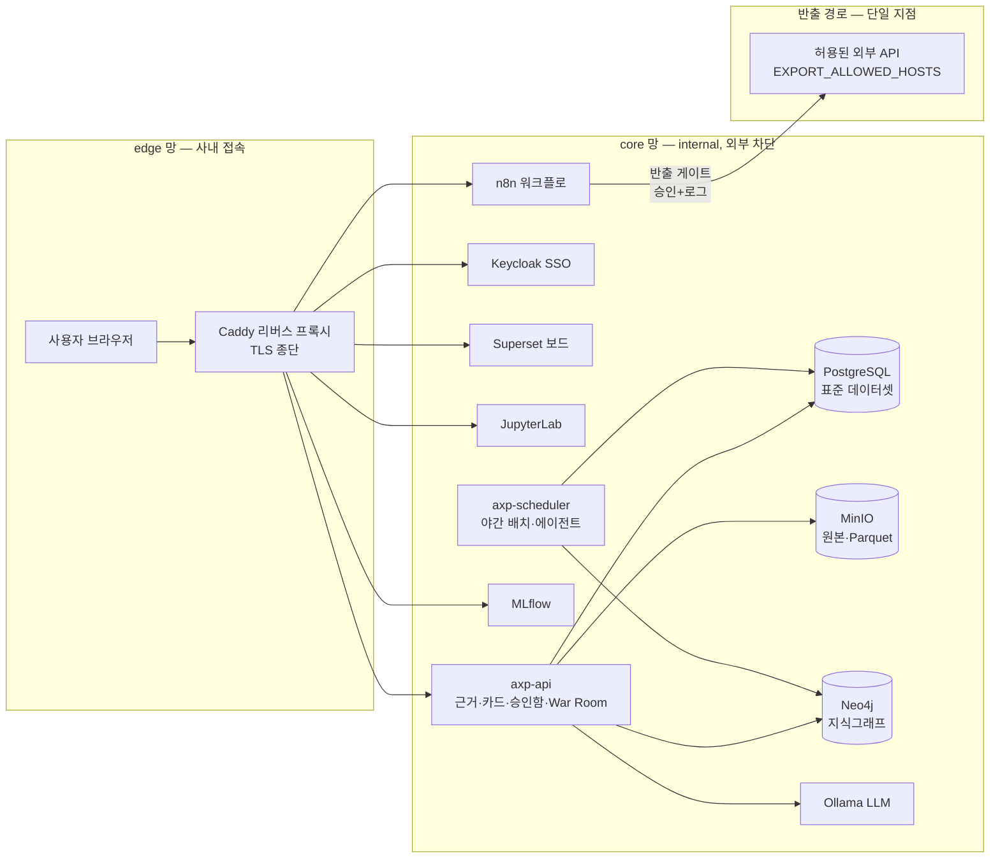

# 네트워크 존 설계 (M0-1)

```mermaid
flowchart LR
  subgraph EDGE[edge 망 — 사내 접속]
    U[사용자 브라우저] --> P[Caddy 리버스 프록시\nTLS 종단]
  end
  subgraph CORE[core 망 — internal, 외부 차단]
    P --> API[axp-api\n근거·카드·승인함·War Room]
    P --> KC[Keycloak SSO]
    P --> SUP[Superset 보드]
    P --> JUP[JupyterLab]
    P --> N8N[n8n 워크플로]
    P --> ML[MLflow]
    API --> PG[(PostgreSQL\n표준 데이터셋)]
    API --> MIN[(MinIO\n원본·Parquet)]
    API --> NEO[(Neo4j\n지식그래프)]
    API --> OLL[Ollama LLM]
    SCH[axp-scheduler\n야간 배치·에이전트] --> PG
    SCH --> NEO
  end
  subgraph EXPORT[반출 경로 — 단일 지점]
    N8N -->|반출 게이트\n승인+로그| EXT[허용된 외부 API\nEXPORT_ALLOWED_HOSTS]
  end
```

원칙 세 가지.
1. core 망은 `internal: true` — 컨테이너가 임의로 밖에 나갈 수 없다.
2. 들어오는 길은 프록시 하나, 나가는 길은 반출 게이트 하나.
3. 사용자는 전부 Keycloak SSO를 거친다(권한 매트릭스는 auth-roles.md).
